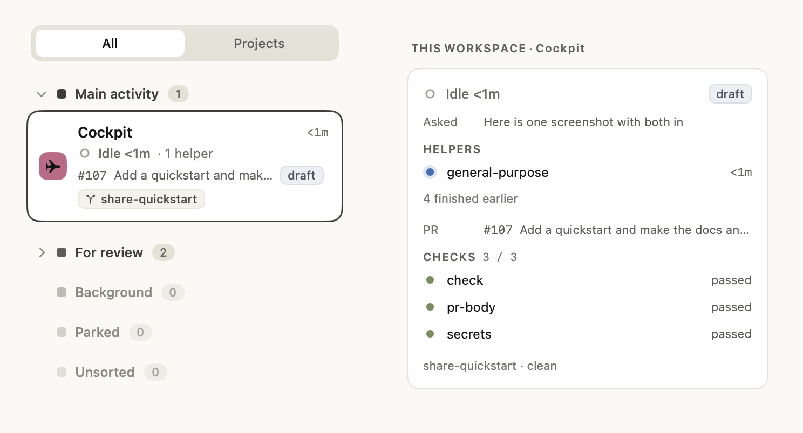

# cmux-cockpit

Two custom sidebars for [cmux](https://github.com/manaflow-ai/cmux), the
macOS terminal for running coding agents. The cockpit, on the left, sorts
your workspaces into lanes and flags the agents waiting on you, telling an
agent that is asking a question apart from one that has finished its turn.
The agents panel, on the right, details the selected workspace, your open
pull requests and the pages your agents published.



**To install, follow the [quickstart](docs/quickstart.md)** (about 10
minutes): back up, clone, `npm ci`, `npm run setup`. `npm run doctor`
checks an install, and `npm run uninstall` takes the extras out again.

This is a personal setup shared as is. It follows cmux's custom sidebar
beta, which has no published schema yet, so a cmux update can break it.
Tested on cmux 0.64.25.

## Requirements

- macOS with cmux, and custom sidebars switched on
  (`customSidebars.beta.enabled` in `cmux.json`; the quickstart does this).
- Node 24.2 or later.
- To commit or run `npm run check`: Rust through rustup. The toolchain
  pinned in `rust-toolchain.toml` installs itself on first use.
- Optional: Claude Code for the hooks, and `gh` signed in for pull request
  chips.

## What is here

- `src/cockpit/`: the left sidebar. All and Projects views, a "Needs you"
  strip (with dismiss), and workspace cards in lanes or grouped by
  project. Lanes are cmux workspace groups, by default "Main activity",
  "For review", "Background" and "Parked" (your own in
  [`config/lanes.json`](#lanes-configlanesjson)); everything else is
  Unsorted. An
  agent stopped on a permission or a question shows amber, "Asking", with
  the reason; one that finished its turn shows clay, "Your turn" (the
  first needs the notification hook in the
  [quickstart](docs/quickstart.md#claude-code-hooks)).
- `src/agents/`: the agents panel, shown in the right sidebar.
- `src/shared/`: helpers the sidebars share (text clean-up, projects, agent
  ranking, time, and the "needs you" rules both sidebars apply: Claude
  Code's idle nudge reads as idle, and dismissals), plus one copy of what
  should look the same on both sides: the colours (`palette.ts`), the
  status words (`words.ts`, "Finished 3m") and the view builders for rings,
  chips, the unread badge, trailing times and headings (`ui.ts`).
- `src/renderer.d.ts`: types for the renderer's globals and live data.
- `sidebars/*.js`: local build output, built from `src/`. Never committed,
  never edited by hand.
- `sidebars/*.parked`: retired Swift sidebar experiments cmux does not
  load. Rename one to `.swift` to load it again. `probe.swift.parked`
  probes what the Swift renderer supports; on cmux 0.64.25 a `let` derived
  from `data` renders empty, so filters go inline in the view.
- `cmux.example.json`: the minimum app settings, which switch on custom
  sidebars. Copy it to `cmux.json` (ignored by git) and add your own.
- `dock.example.json`: a sample dock control. Copy it to `dock.json`
  (ignored by git) if you want it.
- `automations.json`: cmux automation rules, linked into `~/.cmuxterm/`
  (see the [quickstart](docs/quickstart.md#pull-request-chips-and-keeping-the-agents-panel)).
- `config/projects.example.json`: the committed sample project table.
  `config/projects.json` is your real, gitignored table; never commit it.
  Each entry is `match`, `name`, `color`, `icon`, plus an optional `root`
  (an absolute path, `~` allowed) that puts a "+" on the project's header
  in the Projects view, opening a new workspace there. Projects with no
  sessions fold into one "Quiet" line of icons at the bottom; tapping an
  icon does the same as "+", and one without a `root` sits dimmed with no
  tap. The file is the starting table: right-click any project's header
  (or quiet row) and choose "Edit project" to rename it, pick its colour
  and icon, change its folder or remove it. To add one, tap "+ New
  project" above the quiet ones and type its folder (`~` allowed), or tap
  a folder you have open; a card under Other also offers "Make ... a
  project", as its menu's "New project from this folder" does. Those edits
  live in `config/state.json` and win over the file at build.
- `native/`: one Cargo workspace for the native rewrite: `core` (the
  `cockpit_core` Crux app), `runner` (`cockpit_runner`, the live-data
  runner any front end drives) and `pane` (`cockpit-pane`, the cockpit in
  a terminal, a thin loop over the runner; `--print` prints the view as
  text). The core builds the panel model every shell draws
  (`cockpit_core::panel`), and `native/fixtures/` holds it as JSON for
  each scene; the core's tests fail when a fixture is stale.
  `rust-toolchain.toml` pins the Rust toolchain.
- `native/mac/`: the macOS helper app with the Cockpit sidebar extension
  embedded, which cmux draws in its left sidebar. Build it, run it and
  switch it on in cmux with [native/mac/README.md](native/mac/README.md).
- `helper/` and `scripts/`: the URL handler app that saves state, the
  build, the pull request poller and the Claude Code hooks
  ([docs/state-loop.md](docs/state-loop.md)).

## Lanes: config/lanes.json

The lanes are a table you can change. `config/lanes.json` is yours and
gitignored; `config/lanes.example.json` is a committed sample to copy.
With no file, or an empty array, you get today's four lanes. The file is a
bare JSON array of lanes in the order they draw; Unsorted is built in and
always last, holding every workspace outside the others.

| Field | What it does | Left out |
| --- | --- | --- |
| `name` | The cmux group the lane matches, and its heading. Needed. | |
| `id` | What saved folds and moves key on. Keep it when you rename. | the name |
| `color` | A lane token: the greys `laneMain`, `laneReview`, `laneBackground`, `laneParked`, `laneUnsorted`, or the hues `laneViolet`, `laneTeal`, `laneRose`, `laneBrown` | |
| `density` | `full`, `compact` or `row` | |
| `folded` | Starts folded until you fold or open it | |
| `faint` | Its heading and merge-ready hint draw faint | |
| `leftOff` | Its cards say where you left off ("You: ...") | |

A field left out takes the value of the built-in lane with the same `id`
(`main`, `review`, `bg`, `parked`), else compact, unfolded and plain in
`laneUnsorted`'s grey. So `{ "id": "parked", "name": "Shelf" }` is Parked
renamed, still faint, folded and in rows. Every colour is a token, so it
follows light and dark mode; a hex is refused. The four hues are chosen
clear of the state colours (clay, amber, blue, the greens and red), so a
lane marker never reads as an agent's state.

The file fails whole on a lane with no name, a field it does not know (a
typo such as `colour` is refused, not ignored), an unknown colour or
density, an id or name used twice, or the id or name `unsorted`. A bad
file fails `npm run build`; the native panel keeps the table it had.

Renaming a lane in the file does not rename its cmux group: its cards
show in Unsorted until you rename the group in cmux to match (or drag
them across). The placeholder cmux makes for a group counts as the
lane's anchor only while its title matches the group's name, so retitle
it too.

To take a change: `npm run build` and reload the sidebar for the JS
cockpit. The native panel's helper watches the file and picks it up live.

## Working on a sidebar

```
npm run dev                         # rebuild sidebars/*.js on every save
npm run check                       # lint, types, dead code (knip), build fresh, tests with a coverage floor, validate, then npm run rust
npm run rust                        # rustfmt, clippy with warnings denied, and the Rust tests under native/
npm run snapshots                   # re-record the text snapshots after a change on screen
UPDATE_SNAPSHOTS=1 cargo test --manifest-path native/Cargo.toml -p cockpit_core --test panel && npx biome format --write native/fixtures   # re-record the panel fixtures after a meant change
npm run preview                     # every snapshot scene as a PNG in preview/ (needs Google Chrome)
npm run pr-visuals                  # before/after PNGs of the scenes this branch changes, pushed to pr-images, as markdown for the PR
cmux sidebar reload cockpit         # show the change
```

`npm run agents` restores the agents panel in the right sidebar (wraps
`cmux right-sidebar set custom agents`), in case it ever gets swapped out.

cmux drops the right sidebar out of the agents panel when it creates a
window (an app restart, `cmux restore-session`): it falls back to Files if
the custom sidebar is not available yet and saves that over the remembered
mode ([#27](https://github.com/jonyardley/cmux-cockpit/issues/27)). The
`restore-agents-panel` rule in `automations.json` puts that window back in
agents mode if it falls out in the next ten seconds. `cmux automation
enable` or `disable` may rewrite the linked file, through the link into
the repo or over the link with a plain copy; edit the repo file instead.

`cmux sidebar validate` only reads `~/.config/cmux/sidebars`, so it runs in
the main checkout only; in a worktree `npm run validate` skips with a note.

[CONTRIBUTING.md](CONTRIBUTING.md) covers the optional git hooks.

## Rules the renderer taught me

- Sidebars cannot import at runtime, so `src/` is bundled into one flat
  script per sidebar.
- Borders use `ring()`, never `borderWidth` (it is clipped by the corner
  radius). Pass `hug` for chips and buttons.
- Outer margins go on a wrapper VStack; on the same node the background is
  drawn under the padding.
- A sidebar cannot switch the right sidebar's mode: only the CLI can.
  `sidebar.custom.open` opens a pane in the middle instead.
- Put taps on a shape, not a framed Image, or only the glyph takes the tap.

## Contributing and licence

See [CONTRIBUTING.md](CONTRIBUTING.md) and [SECURITY.md](SECURITY.md).
Released under the [MIT licence](LICENSE).
